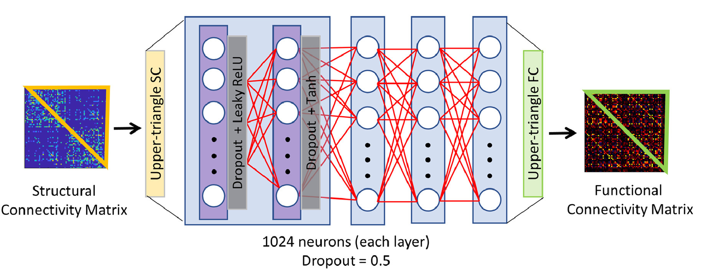
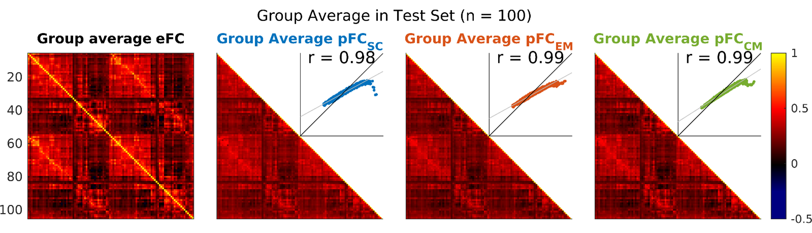
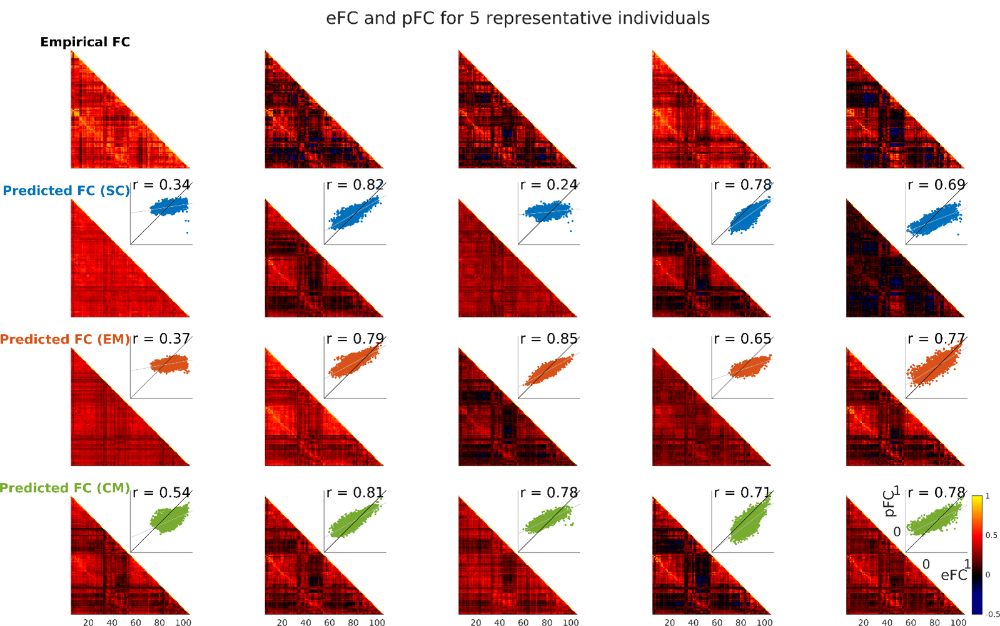
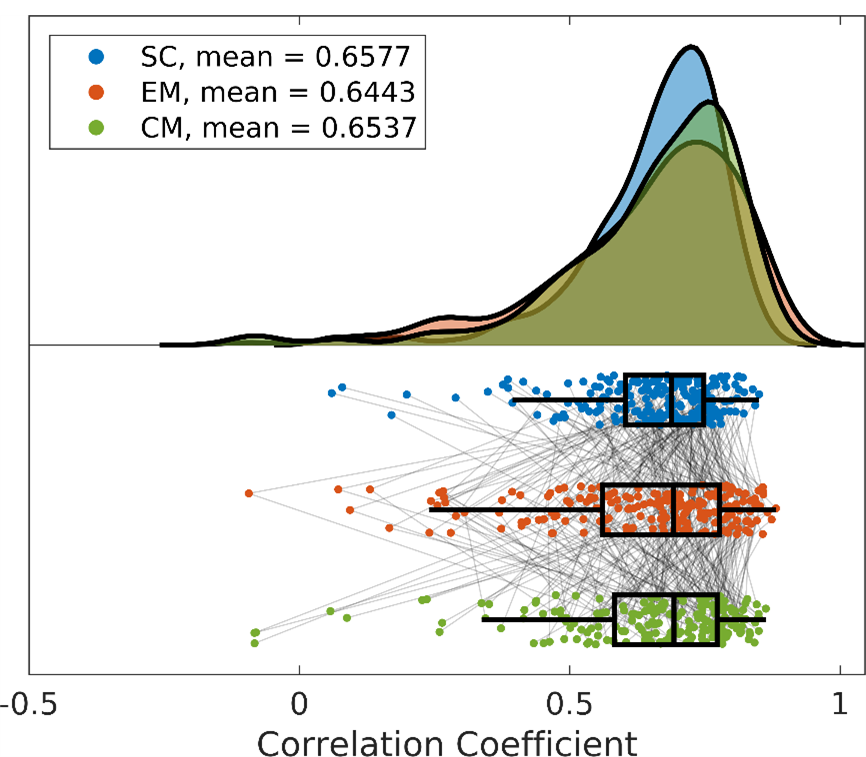

# Predicting Functional Connectivity from Geometric Eigenmodes
*A project predicting individual FC from geometric eigenmodes, and comparing this to existing SC models*
You can see the poster about this work [here](blob/eigenmode-fc_coupling.pdf).

## Introduction
Prior work to date has generally used geometric eigenmodes to linearly reconstruct a phenotype of brain organisation (e.g., resting-state FC and task-based fMRI in (Pang et al., 2023) and cortical thickness in (Cao et al., 2023)). Here the target of the reconstruction y is estimated by least squares fit of n geometric eigenmodes `y=\Sigma_{i=1}^n \Beta_i \Psi_i`. Using spatial correlation with FC as a measure of reconstruction accuracy, Pang and colleagues (2023) found a reconstruction accuracy of around 0.8 when using 100 modes, and around 0.9 using 200 modes. Moreover, the reconstruction accuracy of geometric eigenmodes substantially exceeded that of connectome eigenmodes. 

However, a limitation of this approach is that it focusses only on a linear reconstruction of the target map; the true relationship between SC and FC is unlikely to be mediated this way. This has been partially explored in recent work assessing structure-function coupling in the brain. In the linear regime, SC has rarely explained more than 50-60% of the variance in FC (Sarwar et al., 2021). However, a non-linear, deep learning approaching has seen SC explain up to 90% of the variance in FC. Sarwar and colleagues (2021) used a feed-forward fully connected neural network (NN) to predict FC from SC (Figure 3). The network was provided with the 2278 elements of the upper triangle of the SC matrix as input, and was trained to predict the 2278 elements of the empirical FC network. Of note, given the possibility of the network prediction converging on the group average, the loss function penalised both (i) deviation of the predicted FC from the empirical FC; and (ii) excessive similarity in the predicted FC networks across individuals. The network was comprised of 8 hidden layers of 1024 neurons each, and took 20 hours to train on a P100 Nvidia GPU system. 

Figure 1: Neural network architecture used to assess structure-function coupling. The architecture of the feed-forward fully connected neural network used (Sarwar et al., 2021). Each layer (represented by a blue rectangular box) is a combination of two sub-layers. The input to the neural network is the upper triangle of the SC matrix. The output is the upper triangle of the predicted FC matrix. Reproduced from (Sarwar et al., 2021).

## Aims
In this project, we aim to improve models of structure-function coupling by predicting FC from geometric eigenmodes. Firstly, we will trial the Sarwar NN architecture with geometric eigenmodes as inputs, rather than traditional parcellated SC. In this case, the inputs will be the first 50 eigenmodes in a 100-region parcellation; the outputs will be the 4950 elements of the upper triangle of the pairwise FC matrix. We will compare both geometric and connectome eigenmodes to SC as possible predictors of FC, and will explore which provides a higher reconstruction accuracy. Overall, this model will allow for (i) prediction of FC at the individual level; and (ii) direct estimation of FC, rather than computation of FC by reconstruction of rsfMRI timepoints. 

## Methods
All models were trained on the same dataset, derived from minimally-processed structural, functional, and diffusion data from the Human Connectome Project as previously described (Glasser et al., 2013; Oldham & Ball, 2023; Pang et al., 2023). Cortical surface meshes, SC, and FC matrices passed quality control in 967 subjects; 767 were used for training, 100 for validation/hyperparameter tuning, and 100 for testing. 

We use the deep learning framework developed in (Sarwar et al., 2021) to test three competing machine learning models. Firstly, vectorized structural connectivity is used as the input into a fully-connected feed-forward neural network. In the second model, geometric eigenmodes (EM) were calculated from the left and right hemisphere surfaces meshes in fsLR-32k CIFTI space as previously described (Pang et al., 2023), resulting in the generation of 32,492 eigenmodes for each hemisphere. The first 50 eigenmodes were retained and were then parcellated using a 100 node parcellation (Schaefer et al., 2018). Thus, for each individual, a vector of 100 × 50 = 5000 elements was used as input into a neural network. Finally, for the third model, 50 connectome eigenmodes (CM) were generated from the eigenmodes of the Laplacian of each individual’s parcellated structural connectivity matrix (Naze et al., 2021). This also resulted in a vector of 100 × 50 = 5000 elements as input into a neural network. 

Each network was trained using the Adam optimizer, with the following hyperparameters tuned: learning rate, batch size, regularization constant, regularization parameter, dropout rate, number of layers, and number of neurons per layer. After training, one run of each model was selected by matching the model inter-prediction similarity to the empirical distribution of similarity between individuals’ FC.

## Results
Model accuracy was assessed using Pearson product-moment correlation. Group level estimates were generated by averaging model predicted FC (pFC) across individuals, and comparing this to the average of the empirical FC (eFC) in the same individuals. Across 100 individuals in the test set, we see correlations of 0.98 for the SC model, 0.99 for the EM model, and 0.99 for the CM model (Figure 4). Across all group reconstructions, the small differences seen between the SC and EM/CM models are largely driven by the erroneous predictions of ≈1% of the most strongly connected edges (Figure 4 inset).

At the individual level, we are able to reconstruct individual FC matrices more accurately than the previous state-of-the-art: SC r = 0.63 ± 0.19; EM r = 0.64 ± 0.15; CM r = 0.65 ± 0.17. Results from five example individuals are shown in Figure 5. Although there is some variance across individuals, models generally replicate large-scale patterns in FC throughout the cortex. Additionally, individuals with erroneous reconstructions vary between models (i.e. different models generate poor predictions for varied individuals – rather than all models underperforming on the same individuals; Figure 6). Finally, paired-samples analysis of variance showed no significant difference between the predictive accuracy of each model across 100 test subjects. 

Figure 2: ML FC group-averaged reconstructions. Leftmost, the average FC of the 100 individuals in the test set (the target of the predicted FCs). Right, group-averaged predicted FC from each of the three ML models; inset, scatter plot of pFC vs eFC for each model and Pearson correlation coefficient. eFC, empirical functional connectivity; pFC, predicted functional connectivity; SC, structural connectivity; EM, geometric eigenmodes; CM, connectome eigenmodes. 

Figure 3: ML FC reconstruction for 5 representative individuals. Each column shows the empirical FC for one individual as well as model predictions from each of the three ML models; inset, scatter plot of pFC vs eFC for each model and Pearson correlation coefficient. eFC, empirical functional connectivity; pFC, predicted functional connectivity; SC, structural connectivity; EM, geometric eigenmodes; CM, connectome eigenmodes. 

Figure 4: Individual-level ML reconstruction accuracy. Correlation between empirical FC and model-predicted FC for 100 individuals across each of the three ML models. SC, structural connectivity; EM, geometric eigenmodes; CM, connectome eigenmodes. 

## Conclusions
Overall, we construct fully-connected feed-forward neural networks that are able to reconstruct individuals’ FC more accurately than previously described state-of-the-art models. Furthermore, at both the group and individual level, these models have equal performance in reconstructing FC from structural connectivity, geometric eigenmodes, or connectome eigenmodes. Whilst geometric eigenmode models are able to exceed connectome eigenmode models’ FC reconstructions in a linear regime, these results suggest that geometric and connectome models contain the same amount of information pertaining to FC reconstruction. However, it should be noted that recent work has shown that the accuracy of machine learning models (especially neural networks) may be driven by group mean effects (Chen et al., 2023; Jamison et al., 2024; Smolders et al., 2023); ongoing work in this project will aim to clarify the robustness of our models to alterations in the group mean. 

## Bibliography
Some original fingerprinting papers
- Predicting human resting-state functional connectivity from structural connectivity
- Functional connectome fingerprinting: identifying individuals using patterns of brain connectivity

Inspiration for our method
- Original paper: Structure-function coupling in the human connectome: A machine learning approach
- Commentary: Can structure predict function at individual level in the human connectome?
- Reply: Predicting an individual’s functional connectivity from their structural connectome: Evaluation of evidence, recommendations and future prospects

Review articles 
- How to measure functional connectivity using resting-state fMRI? A comprehensive empirical exploration of different connectivity metrics
- A Gentle Introduction to Graph Neural Networks - from a tutorial site called "Distill"
- Graph neural networks, Corso et al. Nat Rev. Methods Primers

Some assorted papers I liked (not all directly relevant)
- Predicting individual task contrasts from resting‐state functional connectivity using a surface‐based convolutional network
- Predicting the retinotopic organization of human visual cortex from anatomy using geometric deep learning
- conn2res: A toolbox for connectome-based reservoir computing
- Release the Krakencoder: A unified brain connectome translation and fusion tool

Some assorted new papers 
- covSTATIS: a multi-table technique for network neuroscience
- Predicting resting-state brain functional connectivity from the structural connectome using the heat diffusion model: a multiple-timescale fusion method
- Group-common and individual-specific effects of structure-function coupling in human brain networks with graph neural networks

## References
Cao, T., Pang, J. C., Segal, A., Chen, Y.-C., Aquino, K. M., Breakspear, M., & Fornito, A. (2023). _Mode-based morphometry: A multiscale approach to mapping human neuroanatomy_ (p. 2023.02.26.529328). bioRxiv. https://doi.org/10.1101/2023.02.26.529328

Chen, P., Yang, H., Zheng, X., Jia, H., Hao, J., Xu, X., Chen, R., Okubo, T. S., & Cui, Z. (2023). _Group-common and individual-specific effects of structure-function coupling in human brain networks with graph neural networks_ (p. 2023.11.22.568257). bioRxiv. https://doi.org/10.1101/2023.11.22.568257

Glasser, M. F., Sotiropoulos, S. N., Wilson, J. A., Coalson, T. S., Fischl, B., Andersson, J. L., Xu, J., Jbabdi, S., Webster, M., Polimeni, J. R., Van Essen, D. C., & Jenkinson, M. (2013). The minimal preprocessing pipelines for the Human Connectome Project. _NeuroImage_, _80_, 105–124. https://doi.org/10.1016/j.neuroimage.2013.04.127

Jamison, K. W., Gu, Z., Wang, Q., Sabuncu, M. R., & Kuceyeski, A. (2024). _Release the Krakencoder: A unified brain connectome translation and fusion tool_ (p. 2024.04.12.589274). bioRxiv. https://doi.org/10.1101/2024.04.12.589274

Naze, S., Proix, T., Atasoy, S., & Kozloski, J. R. (2021). Robustness of connectome harmonics to local gray matter and long-range white matter connectivity changes. _NeuroImage_, _224_, 117364. https://doi.org/10.1016/j.neuroimage.2020.117364

Oldham, S., & Ball, G. (2023). A phylogenetically-conserved axis of thalamocortical connectivity in the human brain. _Nature Communications_, _14_(1), Article 1. https://doi.org/10.1038/s41467-023-41722-8

Pang, J. C., Aquino, K. M., Oldehinkel, M., Robinson, P. A., Fulcher, B. D., Breakspear, M., & Fornito, A. (2023). Geometric constraints on human brain function. _Nature_, 1–9. https://doi.org/10.1038/s41586-023-06098-1

Sarwar, T., Tian, Y., Yeo, B. T. T., Ramamohanarao, K., & Zalesky, A. (2021). Structure-function coupling in the human connectome: A machine learning approach. _NeuroImage_, _226_, 117609. https://doi.org/10.1016/j.neuroimage.2020.117609

Schaefer, A., Kong, R., Gordon, E. M., Laumann, T. O., Zuo, X.-N., Holmes, A. J., Eickhoff, S. B., & Yeo, B. T. T. (2018). Local-Global Parcellation of the Human Cerebral Cortex from Intrinsic Functional Connectivity MRI. _Cerebral Cortex_, _28_(9), 3095–3114. https://doi.org/10.1093/cercor/bhx179

Smolders, L., De Baene, W., Rutten, G.-J., Van Der Hofstad, R., & Florack, L. (2023). _Can structure predict function at individual level in the human connectome?_ [Preprint]. Neuroscience. https://doi.org/10.1101/2023.12.11.568977

