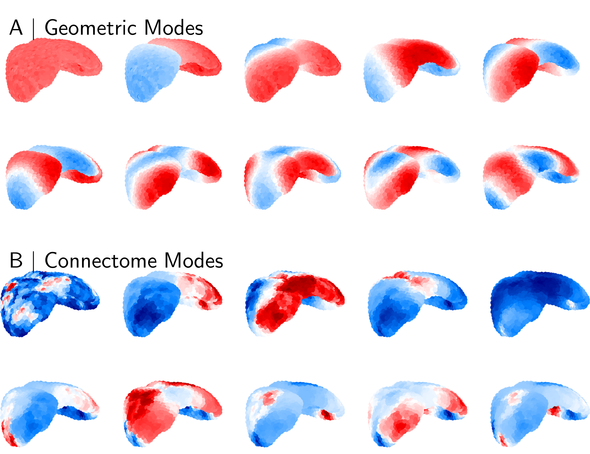
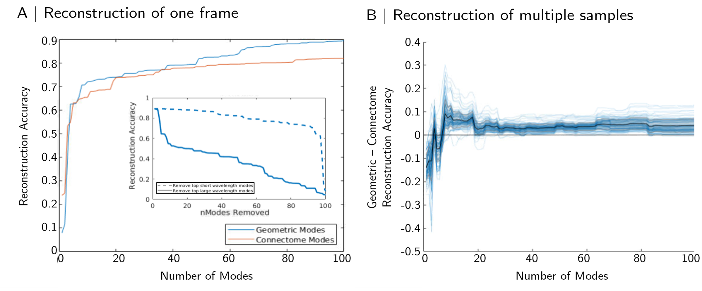

# Geometric and Connectomic Constraints on Mouse Brain Function and Organisation (WIP)
*Do geometric modes continue to outperform connectome modes when using more accurate tract-tracing data?*

## Aims
Here, we aim to clarify whether the detrimental effects of adding connectivity information to eigenmode models are due to noisiness or variability in human diffusion imaging data. We will do this by comparing two eigenmode models in mice: one utilising solely geometric information (i.e. derived from mouse isocortical geometry), and one also incorporating connectivity information (derived from tract-tracing experiments). The primary aim will be to compare the accuracy of each model in reconstructing resting-state functional connectivity. If the geometric model outperforms the connectivity-informed model, this further supports the hypothesis that geometric constraints represent fundamental, cross-species constraint on brain function. Alternatively, if the connectivity-informed model outperforms the geometric model, this suggests that there is something unique to humans – or data acquired from humans – constraining brain function to geometry. 

## Methods
Open-access anatomical, structural, and functional mouse brain data have been previously described (Coletta et al., 2020). Connectome reconstruction and eigenmode analysis will largely follow pipelines previously described (Pang et al., 2023). The mouse isocortex can be represented as a volumetric mesh, and geometric eigenmodes subsequently calculated. Similarly, the mouse tract-tracing connectome can be represented as an adjacency matrix from which Laplacian eigenmodes can be calculated. These will then be used to reconstruct resting-state fMRI signal from awake or sedated mice. 

## Results
Figure 1 shows mouse geometric and connectome modes. Geometric modes (Figure 1A) are calculated based only the isocortical volume. These modes demonstrate smooth variation across the isocortical volume, where higher-order modes represent higher-frequency (shorter-wavelength) patterns of excitation. Contrastingly, even low-order connectome modes show significant variation in their spatial patterns (Figure 1B). 

Figure 1: Mouse isocortical eigenmodes. The first ten geometric (A) and connectome (B) eigenmodes, as derived from the group-averaged isocortical mask and tract-tracing connectome. Note that the sign convention for each mode is arbitrary, and that the first eigenmode in each group varies very close to a constant value.

Figure 2 shows reconstructions of resting state fMRI data using 100 geometric or connectome eigenmodes. Here, due to the nature of the tract-tracing experiments, data are parcellated from the voxel level (~100,000 voxels in isocortex) to 4,223 isocortical parcels; the first 100 modes therefore represent 2.37% of the total basis set. The mode models are still able to reconstruction rsfMRI data parsimoniously: 100 modes are able to reconstruct frames of resting-state data with an accuracy of r = 0.8 (connectome modes) or r = 0.9 (geometric modes; Figure 2). These results are on par with results 

Figure 2: Reconstruction of mouse rsfMRI. (A) Reconstruction of a representative frame of rsfMRI signal using the first 100 geometric (blue) or connectome (red) eigenmodes with reconstruction accuracy measured as the Pearson correlation between empirical and reconstructed maps. Inset, effects of removing short or long wavelength modes from geometric eigenmode reconstructions. (B) Difference in reconstruction accuracy between geometric and connectome modes in 20 such scans; values above 0 favour geometric eigenmodes. 

## Conclusions
Overall, these results largely translate the original findings of (Pang et al., 2023) from human to mouse. Despite using high-quality, invasive mapping of long-distance connections in the mouse brain, we continue to observe geometric modes outperforming connectome modes when reconstructing resting-state fMRI. This is consistent with the hypothesis that brain activity is, in large part, driven by geometric constraints imposing an exponentially decaying connection strength between disparate brain areas. Further work on this project will include null modelling (including using an EDR connectome) and modelling of brain dynamics. 

## References
Coletta, L., Pagani, M., Whitesell, J. D., Harris, J. A., Bernhardt, B., & Gozzi, A. (2020). Network structure of the mouse brain connectome with voxel resolution. _Science Advances_, _6_(51), eabb7187. https://doi.org/10.1126/sciadv.abb7187

Gămănuţ, R., Kennedy, H., Toroczkai, Z., Ercsey-Ravasz, M., Essen, D. C. V., Knoblauch, K., & Burkhalter, A. (2018). The Mouse Cortical Connectome, Characterized by an Ultra-Dense Cortical Graph, Maintains Specificity by Distinct Connectivity Profiles. _Neuron_, _97_(3), 698-715.e10. https://doi.org/10.1016/j.neuron.2017.12.037

Grandjean, J., Canella, C., Anckaerts, C., Ayrancı, G., Bougacha, S., Bienert, T., Buehlmann, D., Coletta, L., Gallino, D., Gass, N., Garin, C. M., Nadkarni, N. A., Hübner, N. S., Karatas, M., Komaki, Y., Kreitz, S., Mandino, F., Mechling, A. E., Sato, C., … Gozzi, A. (2020). Common functional networks in the mouse brain revealed by multi-centre resting-state fMRI analysis. _NeuroImage_, _205_, 116278. https://doi.org/10.1016/j.neuroimage.2019.116278

Gutierrez-Barragan, D., Singh, N. A., Alvino, F. G., Coletta, L., Rocchi, F., De Guzman, E., Galbusera, A., Uboldi, M., Panzeri, S., & Gozzi, A. (2022). Unique spatiotemporal fMRI dynamics in the awake mouse brain. _Current Biology_, _32_(3), 631-644.e6. https://doi.org/10.1016/j.cub.2021.12.015

Knox, J. E., Harris, K. D., Graddis, N., Whitesell, J. D., Zeng, H., Harris, J. A., Shea-Brown, E., & Mihalas, S. (2018). High-resolution data-driven model of the mouse connectome. _Network Neuroscience_, _3_(1), 217–236. https://doi.org/10.1162/netn_a_00066

Pang, J. C., Aquino, K. M., Oldehinkel, M., Robinson, P. A., Fulcher, B. D., Breakspear, M., & Fornito, A. (2023). Geometric constraints on human brain function. _Nature_, 1–9. https://doi.org/10.1038/s41586-023-06098-1

Robinson, P. A. (2019). Physical brain connectomics. _Physical Review E_, _99_(1), 012421. https://doi.org/10.1103/PhysRevE.99.012421

Robinson, P. A., Zhao, X., Aquino, K. M., Griffiths, J. D., Sarkar, S., & Mehta-Pandejee, G. (2016). Eigenmodes of brain activity: Neural field theory predictions and comparison with experiment. _NeuroImage_, _142_, 79–98. https://doi.org/10.1016/j.neuroimage.2016.04.050

